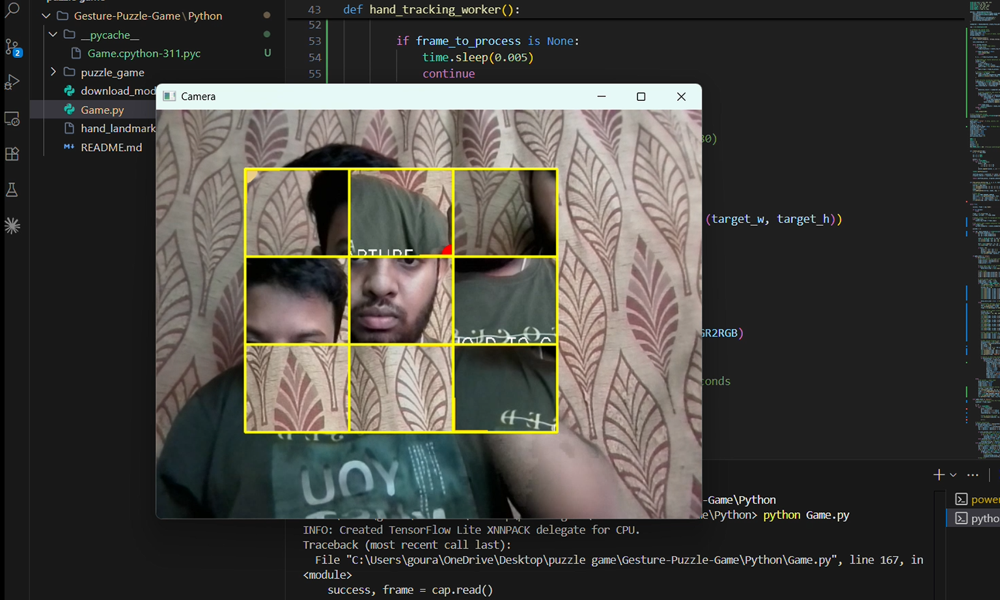

# 🧩 Gesture-Controlled Puzzle Game


<p align="center">
  
</p>

> An interactive, touchless computer vision game that transforms your webcam into a virtual playground. Solve puzzles using entirely hand gestures—no mouse, keyboard, or touchscreen required.

---

## 🌟 Key Features

* **Custom Puzzle Generation:** Draw a virtual "viewfinder" box in the air using a two-handed pinch gesture. Hold for 1 second to capture the frame and instantly generate a scrambled 3×3 puzzle.
* **Touchless Interaction:** Physically "grab" puzzle pieces in the air. Use a single-hand pinch gesture to pick up, drag, and drop/swap tiles across the screen.
* **High-Performance Architecture:** Built with a multi-threaded design. Heavy AI hand-tracking is offloaded to a background process, ensuring the main game loop runs at a butter-smooth 30+ FPS.
* **Dynamic UI & AR Visuals:** Features a stylish augmented reality (AR) viewfinder, 3D-like drop shadows for active tiles, and a dedicated victory presentation screen upon completion.

## 🛠️ Technology Stack

* **Core Logic:** `Python 3`
* **Computer Vision & UI:** `OpenCV`
* **AI & Hand Tracking:** `Google MediaPipe`

---

## 🚀 Quick Start Guide

Follow these steps to set up and run the game on your local machine:

### 1. Clone the Repository
```bash
git clone [https://github.com/gourab354/gesture-puzzle-game.git](https://github.com/gourab354/gesture-puzzle-game.git)
cd gesture-puzzle-game

```

### 2. Install Dependencies

Ensure you have Python installed, then install the required libraries:

```bash
pip install -r requirements.txt

```

### 3. Download the AI Model

This project requires the MediaPipe Hand Landmarker model to function:

1. Download the `hand_landmarker.task` file from the [Official MediaPipe Documentation](https://www.google.com/search?q=https://developers.google.com/mediapipe/solutions/vision/hand_landmarker/index%23models).
2. Move the downloaded `hand_landmarker.task` file directly into the root directory of this project (the same folder where `"puzzle game 1.py"` is located).

### 4. Launch the Game

Since the main script contains spaces in its name, execute it using quotation marks:

```bash
python "puzzle game 1.py"

```

---

## 🎮 Game Controls

| Action | Gesture / Key | Description |
| --- | --- | --- |
| **Capture Image** | `Two-Handed Pinch` | Pinch with both hands to draw a bounding box. Hold steady for 1 second. |
| **Move Tile** | `Single-Hand Pinch` | Pinch over a tile to pick it up, drag to a new slot, and release to drop/swap. |
| **Reset Game** | `R` (Keyboard) | Instantly resets the board and returns to the camera setup phase. |
| **Quit Game** | `ESC` (Keyboard) | Safely closes the application window. |

---

*Developed by [gourab354*](https://www.google.com/search?q=https://github.com/gourab354)

```

```
